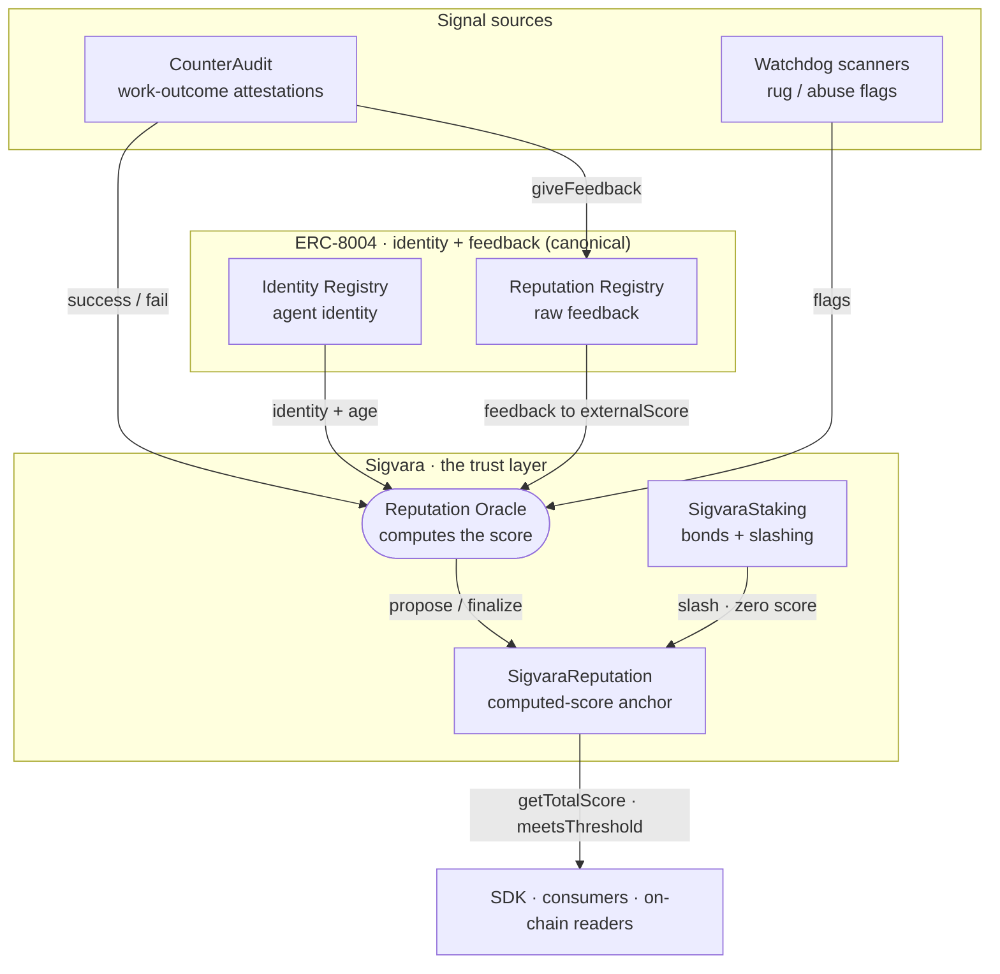
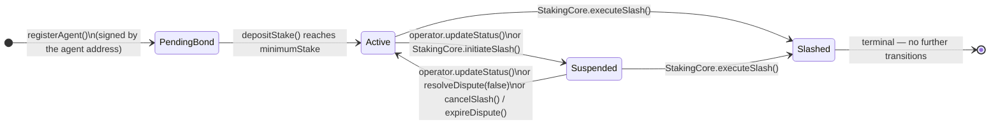
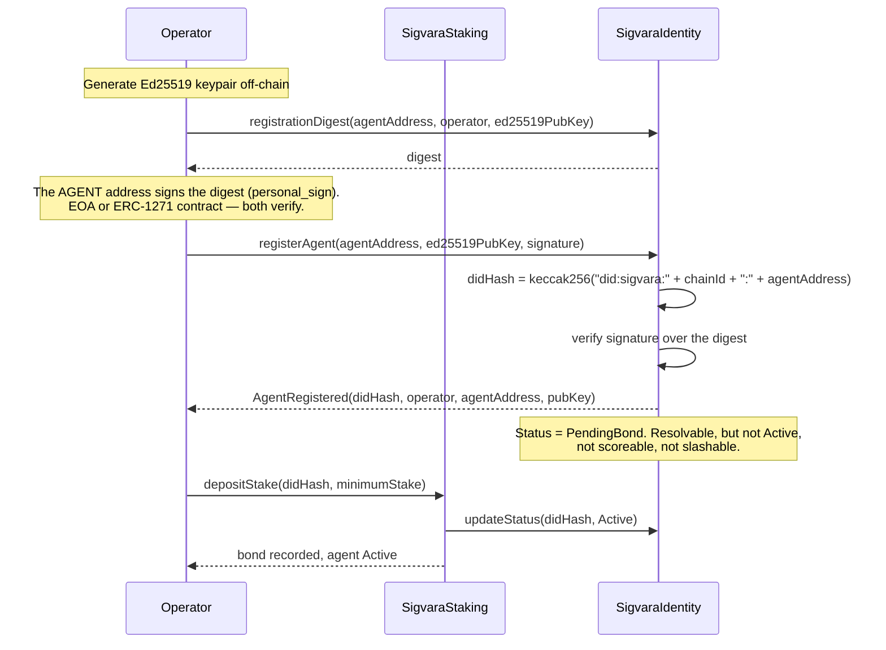
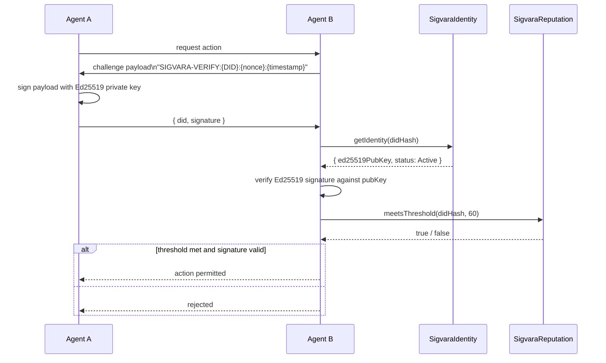
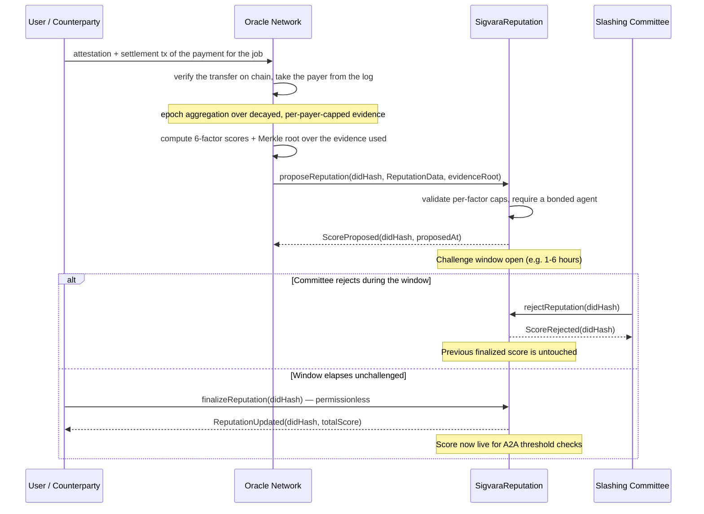

# Sigvara

**Computed reputation and staked slashing for autonomous AI agents, on top of ERC-8004.**

As AI agents become independent economic actors, they need a trust score that means something and accountability that costs something. [ERC-8004](https://eips.ethereum.org/EIPS/eip-8004) gives agents a standard on-chain identity and a raw feedback ledger, but deliberately leaves out the hard parts: computing a trustworthy score from that feedback, and putting slashable stake behind it. Sigvara is that layer. It takes ERC-8004 as the identity and feedback substrate, computes a normalized reputation score with an oracle, and enforces bonds and slashing — the accountability the standard omits. (Ed25519 PKI challenge-response for agent-to-agent auth rides alongside.)

> **Token: not launched yet.** The protocol's bond and fee asset will be **SVR**, a fixed-supply, ownerless ERC-20 launched through Tolly on Arc mainnet with no team allocation, no treasury allocation and no sale. Until its contract address appears in [docs/token.md](docs/token.md) and on [sigvara.xyz](https://sigvara.xyz), there is no genuine SVR; anything trading under the Sigvara name before then, or at any other address after, did not come from this team. On-chain utility begins when the registries deploy to Arc mainnet after audit.
>
> **Where this stands.** Sigvara is a computed-reputation and staked-slashing layer for autonomous agents on top of ERC-8004: the standard covers identity and raw feedback; Sigvara computes a normalized score and puts slashable bond behind it. Contracts, oracle and SDK are built and tested (Foundry unit, fuzz and invariant tests, Slither in CI). The same protocol ran for about a month on Robinhood Chain testnet with a live hourly oracle under its prior name (see [docs/lineage.md](docs/lineage.md)). It is now **deployed and running on Arc testnet** (chain ID `5042002`) with a live oracle, payment-verified attestations and a bonded oracle operator — addresses under [Deployed contracts](#deployed-contracts-arc-testnet) and details in [docs/arc.md](docs/arc.md). The oracle is still a single operator, and there is no external audit. This is early protocol work with real engineering and a documented testnet lineage, not a mainnet product claim. [CounterAudit](https://counteraudit.io) both consumes Sigvara scores and feeds work-outcome attestations back into them.

### This repo vs. the Countersig hosted platform

This repository (`sigvara`) is the **decentralized protocol**: computed reputation and staked slashing on top of ERC-8004 identity, with no central authority. Trust here is enforced by cryptography and cryptoeconomics — nothing to sign up for, nothing to trust us on.

There is a **separate product**, the Countersig platform (repo: [`RunTimeAdmin/Countersig`](https://github.com/RunTimeAdmin/Countersig)), which ships its own npm packages — `@countersig/sdk`, `@countersig/verify`, `@countersig/mcp`, `@countersig/react`. That platform is a centralized, hosted non-human-identity verification service. It is a different product with a different trust model, built by the same team, but it is **not this protocol** and does not read from or write to the contracts below. It kept the Countersig name; the protocol did not (see [docs/lineage.md](docs/lineage.md) for why).

If you're looking for MCP server support or React trust-badge components, those live in the platform repo, not here. If you're integrating with the on-chain protocol — DIDs, staked reputation, permissionless verification — you're in the right place, and [`@sigvara/protocol-sdk`](https://www.npmjs.com/package/@sigvara/protocol-sdk) (source in [`packages/sdk`](packages/sdk), successor to the now-deprecated `@countersig/protocol-sdk`) is the only SDK for it.

## Documentation

| Guide | Audience |
|---|---|
| [Ecosystem Overview](docs/ecosystem.md) | Everyone — start here to understand the full picture |
| [Quickstart](docs/quickstart.md) | Developers — register your first agent in 10 minutes |
| [Arc](docs/arc.md) | Developers — deploy / test on Arc (5042002 / 5042), USDC gas |
| [Deploy to Arc testnet](docs/deploy-testnet.md) | Developers — the first-deployment runbook, step by step |
| [SVR token](docs/token.md) | Everyone — the bond and fee token: contract, distribution, treasury policy, when utility starts |
| [Brand](docs/brand.md) | Designers / frontend — colors, type, layout and component rules for every Sigvara surface |
| [CounterAudit Integration](docs/counteraudit-integration.md) | Enterprise — embed agent identity in your audit trail |
| [AI Framework Integration](docs/ai-frameworks.md) | Developers — LangChain, AutoGen, CrewAI, Node.js |
| [Reputation Model](docs/reputation-model.md) | Everyone — how the 6-factor score works and grows |
| [Payment-backed attestations](docs/payment-backed-attestations.md) | Developers — how an attestation is tied to a settled payment, and the decay, diversity and evidence-root rules around it |
| [Lineage](docs/lineage.md) | Everyone — the Robinhood Chain testnet run this protocol came from (addresses, oracle activity, what changed) |
| [Security & Mainnet Readiness Review](docs/SECURITY_AND_MAINNET_READINESS_REVIEW.md) | Everyone — a point-in-time review dated 17 Sep 2026: conditional no-go for mainnet, with the blockers named |

---

## Deployed contracts (Arc testnet)

Chain ID `5042002`, RPC `https://rpc.testnet.arc.io`, USDC as native gas. Canonical
source is [`deployments/5042002.json`](deployments/5042002.json); the table below is a
convenience copy.

| Contract | Address |
|---|---|
| `SigvaraIdentity` | `0x7e3aFC532eE5d922ab3cc3FFb510c7C8151477Dd` |
| `SigvaraReputation` | `0x6603C96275e85F724Cdf74666b399365e4cA29ed` |
| `SigvaraStaking` | `0xA69d62B2a6774D21A2c15d5d83b27277eD31d35B` |
| `SVRToken` (testnet faucet token, **not** the SVR of [docs/token.md](docs/token.md)) | `0x41De2D6D55318e197a00E8f5B496eA2790e23E6c` |
| `SigvaraOracleBond` | `0x3c9c12F27DDCa7048840eE3fbF0CAa1C547D8171` |

Testnet assets have no economic value. The bond token above is a faucet ERC-20 that
exists so the staking path can be exercised; it is unrelated to the mainnet SVR.

---

## Protocol Architecture

Sigvara is the computed-reputation and staked-slashing layer on top of the
ERC-8004 identity and feedback registries. See [docs/architecture.md](docs/architecture.md)
for the full signal flow.



---

## Contracts

> **Identity layer: ERC-8004.** Sigvara has adopted the [ERC-8004](https://eips.ethereum.org/EIPS/eip-8004) Identity Registry as the canonical agent registry and no longer maintains a competing one. Sigvara is the **computed-reputation and staked-slashing layer on top of the standard** — the parts ERC-8004 deliberately leaves out. See [ADR 0001](docs/adr/0001-erc8004-as-identity-layer.md).

| Contract | Role |
|---|---|
| [`SigvaraReputation`](src/SigvaraReputation.sol) | **Computed-score anchor.** Stores the oracle's normalized, capped 6-factor score — the layer *above* ERC-8004's raw feedback. Exposes `getTotalScore()` and `meetsThreshold()` for on-chain consumers. |
| [`SigvaraStaking`](src/SigvaraStaking.sol) | **Staked accountability.** Agent bond management with committee-initiated slashing (7-day challenge window, permissionless execution after timelock). No ERC-8004 equivalent — this is the differentiator. Bond token is set by address at deploy: the faucet `SVRToken` on testnet, [SVR](docs/token.md) on mainnet — the contracts treat it as a plain `IERC20` either way. |
| [`SigvaraIdentity`](src/SigvaraIdentity.sol) | **The registry in use today.** `did:sigvara` registration with proof of control by the agent address, on-chain Ed25519 PKI, bond-gated status (`PendingBond` → `Active`) and two-step operator transfer. ERC-8004 is the long-term identity layer ([ADR 0001](docs/adr/0001-erc8004-as-identity-layer.md)); until that migration lands this contract is what every deployed component reads and writes. Its non-redundant part (the Ed25519 auth key, bond-gated status, transfer history) becomes an extension keyed to an ERC-8004 agent id. |
| [`SigvaraOracleBond`](src/SigvaraOracleBond.sol) | **Oracle accountability.** Performance bonds for oracle operators. When wired into `SigvaraReputation.operatorBond`, only an admitted, bonded operator can propose a score. Deployed on Arc testnet and wired. |

The retained contracts use UUPS upgradeable proxies (OpenZeppelin v5), controlled by a governance timelock on mainnet.

---

## DID Method

> **Direction of travel.** ERC-8004 agent ids are the intended long-term identifier
> ([ADR 0001](docs/adr/0001-erc8004-as-identity-layer.md)), and the `did:sigvara`
> method below will become a view over one. That migration has not happened yet:
> every agent registered today, on testnet and through the SDK, gets a
> `did:sigvara` and is keyed by its `didHash`.

**Format:** `did:sigvara:<chainId>:<agentAddress>`

**Example:** `did:sigvara:1:0x1234...abcd`

The `didHash` index key is derived trustlessly on-chain at registration:

```solidity
bytes32 didHash = keccak256(
    abi.encodePacked("did:sigvara:", block.chainid, ":", agentAddress)
);
```

Any party can reproduce the hash without querying contract state. The on-chain derivation prevents off-chain forgery.

### DID Document (resolved off-chain)

```json
{
  "@context": [
    "https://www.w3.org/ns/did/v1",
    "https://w3id.org/security/suites/ed25519-2020/v1"
  ],
  "id": "did:sigvara:1:0x1234abcd",
  "controller": "did:pkh:eip155:1:0xOperatorAddress",
  "verificationMethod": [{
    "id": "did:sigvara:1:0x1234abcd#key-1",
    "type": "Ed25519VerificationKey2020",
    "controller": "did:sigvara:1:0x1234abcd",
    "publicKeyMultibase": "z6MkhaXgBZDvotDkL5257faiztiCEsJ"
  }],
  "authentication": ["did:sigvara:1:0x1234abcd#key-1"],
  "assertionMethod": ["did:sigvara:1:0x1234abcd#key-1"]
}
```

---

## Agent Status State Machine



Key invariants:
- Registration mints `PendingBond`, never `Active`. An unbonded agent has nothing to slash, so it is not scoreable either.
- Any transition **into** `Active` requires the agent to hold `minimumStake` — including the ones the staking core makes when a slash is dropped. There is no path back to `Active` while under-collateralized.
- Nothing returns to `PendingBond`. It describes an identity that has never been bonded; an agent does not become un-bonded, it suspends and exits.
- Only `STAKING_CORE_ROLE` can set `Slashed`
- `Slashed` is terminal — no key rotation, no status change
- Suspended agents may rotate their Ed25519 key (key-compromise recovery path)

---

## Reputation System

Scores are computed off-chain by the oracle network and written to `SigvaraReputation`. The contract stores and serves; it does not compute.

| Factor | Max | Source | Formula | Status |
|---|---|---|---|---|
| Fee Activity | 30 | Settled payment volume to the agent, verified on chain | `min(30, decayedVolume / PAYMENT_FEE_UNIT)`, capped per payer | live |
| Success Rate | 25 | Outcome reported by whoever paid (e.g. CounterAudit) | `floor(successful / (total + 5) × 25)`, on decayed weights | live |
| Tenure | 20 | Span of verified paid activity, faded by how long since the last of it | `min(20, floor(log₂(spanDays+1) × 4)) × recency` | live |
| External Trust | 15 | Normalized ERC-8004 feedback (linked agents) | mean of recognized tags × 15 | live |
| Community | 5 | Flags from watchdog feeds (e.g. HoodScan) | `max(0, 5 − flags × 2)` | live |
| Propagation | 5 | Standing of the counterparties that paid the agent | 1 pt per fully-trusted counterparty, pro-rated by its score | live |
| **Total** | **100** | | | |

All six factors are live. Four things shape what the number actually means:

- **Only bonded agents are scored.** A newly registered agent is `PendingBond` and cannot be proposed a score at all. The bond is what makes it slashable, and scoring something unslashable is scoring nothing.
- **Evidence is payment-backed.** With `PAYMENT_VERIFICATION=required`, an attestation must carry the settlement transaction of a real payment to the agent's own address, and the payer is taken from the transfer log rather than asserted by the caller. Self-payments are refused and any one counterparty's evidence is capped. See [payment-backed attestations](docs/payment-backed-attestations.md).
- **Evidence decays.** Each payment is weighted `0.5 ^ (age / half-life)` from the time it *settled*, and the success rate divides by `total + 5` so a decaying record falls toward zero instead of holding a scale-invariant ratio forever. A farmed score is perishable and has to be renewed.
- **A score is earned before it is spendable.** `getEarnedScore()` returns the raw finalized figure; `getTotalScore()` returns the matured one, which climbs toward it at a fixed rate per day and is what `meetsThreshold()` checks. Falls apply immediately. Transferring an agent to a new operator restarts maturity.

`externalScore` is 0 unless the agent links an ERC-8004 identity it owns. See the [Reputation Model](docs/reputation-model.md) for provenance detail and [payment-backed attestations](docs/payment-backed-attestations.md) for how the inputs are verified and committed to.

---

## Slashing Model

**Testnet:** `SLASHING_COMMITTEE_ROLE` is held by a single EOA. **Mainnet path:** a 3-of-5 multisig, then UMA OptimisticOracleV3 or Kleros (isolated in the `initiateSlash` / `disputeSlash` interface, replaceable without storage migration).

No slash has been executed end to end on Arc testnet yet. The lifecycle below is covered by the E2E suite, not by a documented live run.

### Slash Lifecycle

```mermaid
sequenceDiagram
    participant V as Victim
    participant CM as Committee (3-of-5)
    participant ST as SigvaraStaking
    participant ID as SigvaraIdentity
    participant REP as SigvaraReputation

    V->>CM: report agent + evidence package
    CM->>ST: initiateSlash(didHash, victim, evidenceHash)
    ST->>ID: updateStatus(didHash, Suspended)
    Note over ST: 7-day challenge period begins

    alt Operator disputes within window
        Op->>ST: disputeSlash(didHash)
        Note over ST: Proposal → Disputed. Bond stays frozen,<br/>agent stays Suspended
        CM->>ST: resolveDispute(didHash, uphold)
        Note over ST: Upheld slashes; rejected cancels and reinstates.<br/>Unresolved after 14 days, anyone may expireDispute()
    else Challenge period elapses undisputed
        Anyone->>ST: executeSlash(didHash)
        ST->>ID: updateStatus(didHash, Slashed)
        ST->>REP: zeroReputation(didHash)
        ST-->>0xdead: 50% burned
        ST-->>V: 25% to victim
        ST-->>CM: 25% to reporter
    end
```

### Slash Distribution

| Recipient | Share | Mechanism |
|---|---|---|
| `address(0xdead)` | 50% | Deflationary burn |
| Victim | 25% | Recourse for the harmed party |
| Committee reporter | 25% | Incentivizes accurate reporting |

---

## Protocol Flows

### Agent Registration



Registration requires a signature from the agent address itself, over a digest bound to
the chain id, the registry, the operator and the Ed25519 key. Without it anyone could
register an address they do not control and choose the public key that verifiers would
check against it. The digest is returned **unprefixed**: a standard signer applies the
EIP-191 prefix itself, and returning a pre-prefixed value would make every wallet
double-prefix and produce signatures the contract rejects.

### Agent-to-Agent (A2A) Trust Verification



### Reputation Update Lifecycle (Optimistic Scoring)

Reputation updates go through a challenge window before taking effect, rather than writing atomically. This gives the slashing committee a chance to reject a bad proposal before it goes live, without needing a full multi-oracle consensus system.



Every proposal commits to the evidence behind it. `evidenceRoots(didHash)` holds a
Merkle root over the payments the oracle counted; the oracle serves the leaves from
`GET /evidence/:didHash`, and anyone can re-verify each payment against the chain,
rebuild the root and compare — locally or through `verifyEvidence(didHash, leaf, proof)`.
This makes a quietly dropped or invented payment detectable. It does not prove the
oracle counted everything it should have; a payment nobody ever submitted leaves no
trace to be missing from.

---

## Key Rotation

If an Ed25519 private key is compromised:

1. Operator calls `updateStatus(didHash, Suspended)` immediately — invalidates the DID for authentication within one block.
2. Operator generates a new Ed25519 keypair off-chain.
3. Operator calls `rotatePublicKey(didHash, newEd25519PubKey)`.
4. Operator reinstates: `updateStatus(didHash, Active)`.

Slashed agents cannot rotate. The identity is permanently terminated.

---

## TypeScript SDK

```bash
npm install @sigvara/protocol-sdk
```

### Agent-to-Agent authentication

```typescript
import { SigvaraAgent, SigvaraVerifier } from '@sigvara/protocol-sdk';

// Agent A — the prover
const agentA = new SigvaraAgent({
  privateKey: process.env.AGENT_A_ED25519_SEED,  // 32-byte hex seed
  agentAddress: '0xAgentAAddress',
  chainId: 5042002,  // Arc testnet
});

// Agent B — the verifier (has its own identity + a verifier for on-chain lookups)
const agentB = new SigvaraAgent({
  privateKey: process.env.AGENT_B_ED25519_SEED,
  agentAddress: '0xAgentBAddress',
  chainId: 5042002,
});
const verifier = new SigvaraVerifier({
  rpcUrl: 'https://rpc.testnet.arc.io',
  addresses: {
    identity: '0x...  /* from deployments/5042002.json */',
    reputation: '0x...  /* from deployments/5042002.json */',
    staking: '0x...  /* from deployments/5042002.json */',
  },
  chainId: 5042002,
});

// B issues a challenge to A
const challenge = agentB.issueChallenge(agentA.did);

// A signs and returns its DID + signature
const signature = agentA.signChallenge(challenge.payload);

// B verifies: resolves pubkey from chain, checks signature + reputation
const valid = await verifier.verifySignature(agentA.did, challenge.payload, signature);
const trusted = await verifier.meetsThreshold(agentA.did, 60);
```

### On-chain registration (operator)

```typescript
import { registerAgent, depositStake } from '@sigvara/protocol-sdk';

const { didHash } = await registerAgent(
  signer,                        // ethers.Signer with operator wallet
  agentA.agentAddress,           // the agent's Ethereum address (the DID is derived from it)
  agentA.publicKeyBytes32,       // bytes32 Ed25519 public key
  IDENTITY_CONTRACT_ADDRESS,
  { agentSigner },               // proves control of agentAddress; or { signature } if signed elsewhere
);

// The agent is PendingBond until this lands. The first deposit that carries it over
// minimumStake is what activates it.
// Sends the ERC-20 approval only if the allowance is short, then deposits.
await depositStake(signer, didHash, 1000n * 10n ** 18n, STAKING_CONTRACT_ADDRESS);
```

### DID Document resolution

```typescript
const didDoc = await verifier.buildDidDocument(agentA.did);
// Returns W3C-compliant DID Document with Ed25519VerificationKey2020
```

---

## Setup (contracts)

Requires [Foundry](https://getfoundry.sh).

```bash
git clone https://github.com/RunTimeAdmin/sigvara
cd sigvara
forge install
forge build
forge test
```

Deploy and upgrade scripts live in `script/`. `Deploy.s.sol` brings up the
registries and wires roles; `Upgrade.s.sol` moves a single UUPS proxy to a new
implementation and is covered by `test/Upgrade.t.sol`. See
[docs/arc.md](docs/arc.md) for both.

Running the fuzz suite at higher intensity:

```bash
FOUNDRY_PROFILE=ci forge test
```

## Testing

Everything below runs offline, with no network access and no deployed contracts.

| Suite | Count | Command |
|---|---|---|
| Contracts — unit, fuzz, E2E, upgrade and 6 invariants | 235 | `forge test` |
| Oracle | 189 | `cd oracle && node --test` |
| SDK | 58 | `cd packages/sdk && npx vitest run` |

### Unit Tests (default)

Test individual contract functions in isolation. These run on Foundry's in-memory EVM and require no external network.

```bash
forge test                        # all contract tests
FOUNDRY_PROFILE=ci forge test     # denser fuzz runs (5000 iterations)
```

### Invariant Tests

Drive the staking and identity contracts through randomized call sequences and assert
properties that must hold in every reachable state — among them that no agent is ever
`Active` while below `minimumStake`. That one found a real escape: an operator could
queue a withdrawal while Suspended, draw a slash, dispute it, and be reinstated
under-collateralized.

```bash
forge test --match-contract StakingInvariantTest
```

### E2E Integration Tests

Cover the full agent lifecycle: `register → stake → propose/finalize reputation → slash → zero-reputation`. These run in-memory with deployed fixture contracts.

```bash
forge test --match-contract E2EIntegrationTest -vvv
```

Key scenarios tested:
- Full lifecycle from registration to slash
- Slash dispute and agent reinstatement
- Reputation challenge (committee rejects bad score)
- Unbonding period enforcement
- Slash sweeping unbonding queue (dodge prevention)
- Multiple epochs of score evolution
- Multiple independent agents

---

## Access Control Summary

| Role | Holder (Testnet) | Mainnet target | Permissions |
|---|---|---|---|
| `DEFAULT_ADMIN_ROLE` | Deployer EOA `0x18CBcE50…` | Governance timelock | Grant/revoke all roles, set maturity rate, wire the stake view and oracle bond |
| `UPGRADER_ROLE` | Deployer EOA `0x18CBcE50…` | Governance timelock | Authorize UUPS upgrades |
| `STAKING_CORE_ROLE` | `SigvaraStaking` `0xA69d62B2…` | `SigvaraStaking` | Suspend / slash agents, zero reputation, clear slash suspensions |
| `ORACLE_ROLE` | Oracle wallet `0x6352b8FF…` (single operator) | Multiple bonded operators | Propose reputation scores |
| `SLASHING_COMMITTEE_ROLE` | EOA `0x045d6c1D…` | 3-of-5 multisig | Initiate slash proposals, reject bad scores |
| Operator | Agent registrant | Agent registrant | Register, suspend, reinstate, rotate key, transfer the agent |

Every privileged role on testnet is currently a single EOA, including the slashing
committee — the 3-of-5 multisig is the mainnet target, not the present state. Moving
admin and upgrade rights to a timelock or Safe is a named mainnet blocker; see the
[readiness review](docs/SECURITY_AND_MAINNET_READINESS_REVIEW.md).

When `SigvaraReputation.operatorBond` is set, `proposeReputation` additionally requires
the caller to be an admitted, bonded operator in `SigvaraOracleBond` — so `ORACLE_ROLE`
alone is not enough to write a score. Finalizing stays permissionless.

---

## Ecosystem & Integrations

Sigvara is designed as an open identity layer. Any system that needs to know *which* AI agent did *what* can integrate by querying the contracts or consuming CounterAudit enriched packets.

### CounterAudit

[CounterAudit](https://counteraudit.io) is the first integration partner, and it works in both directions. When an ingest call includes `agent_did`, CounterAudit queries the Sigvara contracts at seal time and embeds the agent's identity and reputation score inside the AES-GCM seal, covered by an RFC 3161 timestamp — forensically proving what the agent's reputation was at the moment of each action. When that ingest also carries an `outcome` (`success` / `failure`) for a registered agent, CounterAudit reports it to the reputation oracle, so audited work outcomes feed back into the agent's Success Rate and Fee Activity factors. Reading and writing the same reputation closes the loop.

```typescript
// Every action your agent takes gets sealed with identity + reputation
await fetch('https://api.counteraudit.io/v1/audit/ingest', {
  method: 'POST',
  headers: { 'Authorization': `Bearer ${CA_API_KEY}`, 'Content-Type': 'application/json' },
  body: JSON.stringify({
    connector_id: 'my-agent',
    agent_did: 'did:sigvara:5042002:0x...',
    raw_event: { action: 'tool_call', tool: 'web_search', query: '...' },
  }),
});

// The sealed packet contains:
// agent_reputation_score: 47
// agent_identity_status: "Active"
// agent_identity_verified: true
// agent_enriched_at: "2026-06-30T16:33:39Z"
```

See the [CounterAudit Integration Guide](docs/counteraudit-integration.md) for full setup instructions.

### HoodScan

HoodScan is a rug-risk scanner for Robinhood Chain tokens. When a scan returns a red (high-risk) verdict, it reports the token's deployer address to the reputation oracle as a community flag. If that deployer operates a registered Sigvara agent, the flag lowers its Community factor — so on-chain misbehavior detected off-chain shows up in the agent's reputation. This is the watchdog half of the signal loop: consumers attest to good work, scanners flag bad actors. The oracle's flag endpoint is chain-agnostic, so any scanner can play the same role on Arc.

### On-chain consumers

Any smart contract can gate operations on an agent's reputation:

```solidity
ISigvaraReputation rep = ISigvaraReputation(REPUTATION_ADDRESS);
require(rep.meetsThreshold(didHash, 60), "insufficient reputation");
```

---

## Roadmap

| Phase | Timeline | Deliverables |
|---|---|---|
| Core Protocol | Q3 2026 | contracts, reputation oracle and `@sigvara/protocol-sdk` v1.0 built and tested · CounterAudit attestation + HoodScan flag feeds |
| Arc Port | Q4 2026 | ~~Arc testnet deployment (`5042002`, USDC gas)~~ **done** · ~~oracle epochs against Arc~~ **done** · SVR launch on Arc mainnet ([docs/token.md](docs/token.md)) |
| External Trust | Q4 2026 | ~~externalScore from ERC-8004 feedback~~ **done** (linked agents, live) · ~~agent-vouching graph (propagationScore)~~ **done** (counterparty standing, live) · deeper ERC-8004 interop (publish CounterAudit validations to the Validation Registry) |
| Sybil resistance | Q4 2026 | ~~payment-backed attestations~~ · ~~half-life decay + shrinkage prior~~ · ~~bond required before scoring~~ · ~~self-payment and per-payer diversity caps~~ · ~~tenure in place of calendar age~~ · ~~maturity time-lock~~ · ~~two-step operator transfer~~ · ~~on-chain evidence roots~~ — all **done**, see [payment-backed attestations](docs/payment-backed-attestations.md) |
| Oracle decentralization | Q1 2027 | ~~oracle operator bonds deployed and wired~~ **done** · deterministic scoring off the chain clock · multiple bonded operators with challenge-based disagreement · public challenge watcher |
| Mainnet Registries | Q1 2027 | Tier-1 security audit · admin and upgrade roles onto a timelock or Safe · one documented end-to-end testnet slash · registry deployment on Arc mainnet (`5042`) with bonds and scoring fees in SVR |
| Cross-Chain | Q2 2027 | Solana + Base state mirroring via LayerZero |

The token-launch contract set (fixed-supply `SVR`, vesting, public sale) and the earlier tokenomics and oracle-first direction docs live under [`archive/token-launch/`](archive/token-launch/). They are out of the build; SVR will launch through Tolly rather than these contracts.

---

## License

MIT
