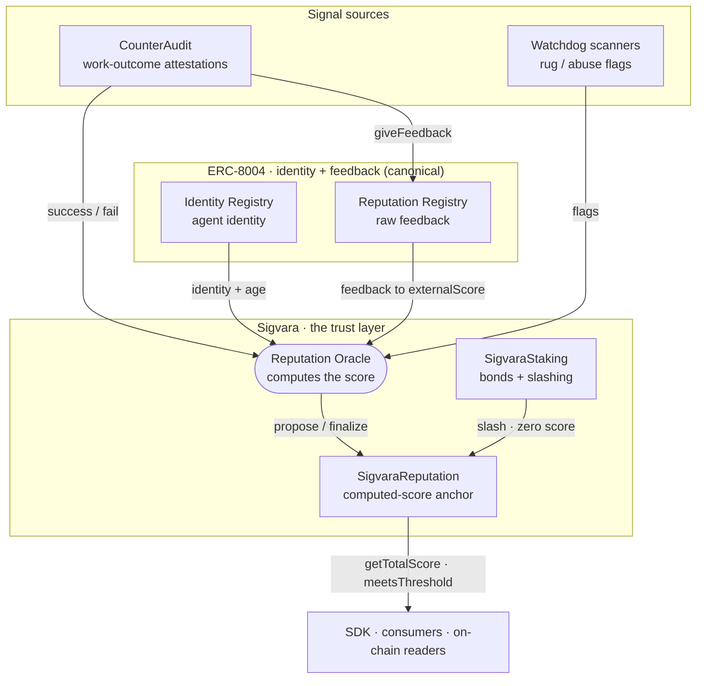

# Architecture — signal topology

Sigvara is the **computed-reputation and staked-slashing layer on top of
[ERC-8004](https://eips.ethereum.org/EIPS/eip-8004)**. ERC-8004 provides the
canonical agent identity and a raw feedback ledger; Sigvara turns that
feedback (plus its own signals) into one normalized score and puts slashable
stake behind it — the parts the standard deliberately leaves out. See
[ADR 0001](adr/0001-erc8004-as-identity-layer.md) for that decision.

Every path a trust signal takes:

## Signals in

The oracle recomputes every factor each epoch from observable data:

- **Payment-backed attestations** — a consuming platform reports, per completed
  job, whether the agent succeeded or failed, and cites the settlement
  transaction of the payment for that job.
  [CounterAudit](counteraudit-integration.md) does this today. The oracle
  verifies the transfer on chain and takes the payer from the log rather than
  from the request, which is what makes the attester an identity rather than a
  claim. This drives the success-rate and fee-activity factors.
- **Flags** — watchdog scanners (e.g. rug detectors on the same chain) report
  misbehaving agents. Flags subtract from the community factor.
- **ERC-8004 feedback** — for an agent linked to an ERC-8004 identity it owns,
  the oracle reads that agent's on-chain feedback and normalizes the rating
  dimensions it recognizes into the external-trust factor (`externalScore`).
- **Counterparty standing** — a payer's own `externalScore`, capped by its matured
  total, which raises how much that payer's evidence is worth and feeds the
  propagation factor. The external part only, not the total: everything else in a
  score can be manufactured by the party being scored, so inheriting a total would
  let a farmed score launder into someone else's. A consequence worth knowing is
  that propagation stays 0 until counterparties hold ERC-8004 standing, however
  well scored they otherwise are.
- **Tenure** — the span between the agent's first and most recent verified
  payment, faded by how long ago that last one was. Deliberately not calendar
  age since registration: waiting is free, and trading is not.

## Score out

The oracle proposes the computed score to `SigvaraReputation`, together with a Merkle
root over the evidence behind it; after a challenge window (rejectable) it finalizes
on-chain. `SigvaraStaking` can slash a misbehaving agent, which zeroes its score.
Consumers read the finalized score with a single view call (`getTotalScore` /
`meetsThreshold`).

Two gates sit on that path. Only a bonded agent can be scored at all, and when
`operatorBond` is wired only a bonded oracle operator can propose. Finalizing stays
permissionless, so nobody can hold a score hostage by declining to write it.

The evidence root is what makes the off-chain half checkable: the oracle serves the
leaves it counted, and anyone can re-verify each payment against the chain, rebuild the
root, and compare it with what the contract holds.

## Who checks the checker

Three processes, on three hosts, with three different RPC providers. The separation is
the design, not an accident of where things landed.

| | Host | Chain view | Holds | Writes |
|---|---|---|---|---|
| **Primary oracle** | one | Circle | signing key, state | proposes and finalizes scores |
| **Checker** | another | QuickNode | signing key, own state | only into an empty slot |
| **Watcher** | a third | dRPC | nothing | nothing |

The **checker** is a second bonded operator that audits instead of competing. It
recomputes each pending score from payment evidence it re-verified against the chain
itself, and records disagreement. It never overwrites a live proposal and never finalizes
one it disputes: overwriting would restart the challenge window and buy a bad proposal
another six hours out of the committee's reach, and finalizing a number it doubts would
launder it into the live value. Two operators competing for one `pendingScores` slot
would produce a race, not agreement, which is why it audits.

The **watcher** exists because a disagreement nobody reads inside six hours is the same
as no disagreement. It polls the checker, re-reads each disputed slot on chain to see
whether the proposal is still live and rejectable, and escalates as the window closes. It
holds no key, so a compromised watcher can lie to you but cannot touch the protocol.

It runs on a third host for a specific reason rather than a general one: it notifies on
state changes only and never on a healthy poll, so nothing downstream can tell a quiet
watcher from a dead one. Sharing a host with the checker would mean one failure silences
both, and the silence would read as "nothing to report".

**What this does not do.** Nothing in the contract requires the two operators to agree.
The checker cannot reject anything; it makes a disagreement legible and a human committee
must act on it. And both operators are run by the same party today, so what has been
demonstrated is that two independent recomputations agree, not that two independent
parties do. See section 5.4 of the whitepaper.

## A deliberate loop-break

CounterAudit feeds the oracle directly (attestations → success factor) **and**
publishes outcomes to the ERC-8004 Reputation Registry (`giveFeedback`) for
ecosystem visibility. The oracle also reads ERC-8004 feedback for
`externalScore` — so CounterAudit's signal could enter a score twice. It does
not: CounterAudit's feedback carries a distinct `counteraudit` tag that the
`externalScore` normalizer excludes, so the circle is cut on purpose. No signal
is double-counted.
