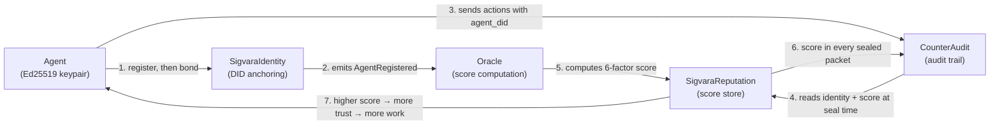

# The Sigvara Ecosystem

Sigvara is a protocol, not a single product. It works by connecting three components that reinforce each other. This document explains each component and how data flows between them.

---

## Components

### SigvaraIdentity (on-chain)

The DID registry. When an agent registers, the contract computes a `didHash` from the agent's Ethereum address and chain ID, stores the operator address and Ed25519 public key, and emits an `AgentRegistered` event. The agent now has a globally unique, chain-anchored identifier: `did:sigvara:<chainId>:<agentAddress>`.

### SigvaraReputation (on-chain)

The reputation store. The oracle writes a 6-factor score (0–100) here every epoch. Any on-chain contract or off-chain consumer can call `getTotalScore(didHash)` or `meetsThreshold(didHash, minScore)`. The contract stores and serves; it does not compute.

### SigvaraStaking (on-chain)

The bond. An agent registers first and lands in `PendingBond`; the first deposit that carries it over `minimumStake` is what makes it `Active`, scoreable and slashable. If the agent misbehaves, the slashing committee initiates a slash: the agent is suspended, a 7-day challenge window opens, and if unchallenged the bond is burned/distributed, reputation is zeroed, and the agent is permanently terminated.

### Oracle

An off-chain service that watches the `AgentRegistered` events on Identity, aggregates its signals (payment volume verified on chain, outcomes reported by whoever paid, tenure, counterparty standing, watchdog flags, external ERC-8004 trust), and calls `proposeReputation()` on the Reputation contract every epoch, committing to the evidence it used with a Merkle root. Proposed scores sit through a challenge window (rejectable by the slashing committee) before anyone can call `finalizeReputation()` to make them live. The reference implementation is in `oracle/`. It is a single operator today, bonded in `SigvaraOracleBond` so a bad proposal costs its proposer; replacing it with several bonded operators that can challenge each other is the next step.

### CounterAudit (first integration, common ownership — see below)

CounterAudit is a tamper-evident AI audit trail service. An ingest call carrying an `agent_did` field makes CounterAudit query Sigvara at seal time, embed the agent's on-chain identity and reputation score inside the AES-GCM seal, and attach an RFC 3161 timestamp. The property that makes it worth having is that the score is captured *at the moment of the action* and frozen into a tamper-evident record, rather than looked up later from a score that has since moved.

> **Broken since 17 September 2026.** The code exists and is wired end to end, but it predates this protocol's rename from Countersig: it parses `did:countersig:` only, and derives the DID hash from that prefix. A current `did:sigvara:` DID is rejected, and the hash it would compute does not match what the contract holds, so the agent reads as unregistered. Renaming the protocol changed what the hash commits to and this code was not updated to follow. Fix pending; nothing below works until it lands.

---

## Where Sigvara sits in CounterAegis

Sigvara shares an owner with [CounterAegis](https://counteraegis.com), a suite of three
trust products. Stating that plainly matters more than the positioning does, so it comes
first: **CounterAudit is not an arm's-length third party.** The same people run both. It is
the intended source of negative outcome attestations, which are the ones that stay
token-gated because they can be weaponised, so anyone weighing how independent this
reputation signal is should weigh that too. It is a single-operator oracle today by the
same token, which the README says as well.

That concentration is currently dormant rather than absent: the integration is implemented
but broken, so nothing outside the oracle operator writes to the score today. It resumes
the moment the DID scheme is fixed, which is a reason to settle the independence question
before then rather than after.

The suite divides by question:

| Question | Product | |
|---|---|---|
| Who acted? | [Countersig](https://countersig.com) | identity, policy and auth for humans and agents |
| What was touched? | [ProvenanceAI](https://provenanceai.network) | content fingerprinting, verification, lineage |
| Can we prove it? | [CounterAudit](https://counteraudit.io) | sealed packets, hash chain, RFC 3161, regulator exports |

Sigvara answers a fourth that none of them do: **should this agent be trusted, and what
does it lose if it defects?** The three products establish and evidence what happened
inside an organisation's boundary. Sigvara is what makes an agent's track record portable
and costly to fake outside it, because the bond and the score live on a public chain
rather than in anyone's database.

A naming note, since the history is confusing: this protocol was **Countersig Network**
until 17 September 2026 and is unrelated to the Countersig product above, which is
enterprise identity software. The rename to Sigvara removed the collision. See
[lineage.md](lineage.md).

### The coupling rule

Integrations are optional connectors, never runtime dependencies, in both directions.
CounterAudit already states it "runs standalone (no Countersig or ProvenanceAI runtime
dependency)", and Sigvara holds the same line: enrichment failures never block a seal, and
the oracle has no CounterAegis service in its critical path. A protocol whose liveness
depends on its owner's SaaS is not infrastructure, it is a product with extra steps.

---

## The Ecosystem Loop

**Steps 3, 4 and 6 are implemented but currently broken** by the DID-scheme mismatch above.
Registration, bonding, oracle scoring and the on-chain score (1, 2, 5, 7) run today on Arc
testnet.




Step by step:

1. The operator generates an Ed25519 keypair and calls `registerAgent()`, with a signature from the agent address proving it controls itself. The DID is now globally resolvable, but the agent is `PendingBond`. A `depositStake()` over `minimumStake` makes it `Active`.
2. The oracle detects the `AgentRegistered` event and begins tracking the agent. It will not propose a score until the agent is bonded.
3. The agent does work. Every action is submitted to CounterAudit with the `agent_did` field. (Implemented; undocumented in CounterAudit's `openapi.yaml`.)
4. Before sealing each packet, CounterAudit reads `getIdentity(didHash)` and `getTotalScore(didHash)` on-chain. (Implemented; currently derives the wrong `didHash`.)
5. The oracle computes the 6-factor score from on-chain signals and writes it to SigvaraReputation.
6. The score — plus status, DID hash, chain ID, and enrichment timestamp — is embedded inside the sealed, timestamped packet. (Implemented.)
7. Consumers query the sealed record. A low-reputation agent's packets are flagged. A high-reputation agent's packets carry a verified track record. Over time, reputation determines which agents get work.

---

## What Gets Sealed

These fields are implemented. They are absent from packets today only because the DID scheme mismatch above makes every lookup fail.


Every CounterAudit packet whose ingest call includes `agent_did` will contain these fields inside the seal:

| Field | Type | Meaning |
|---|---|---|
| `agent_did` | string | The W3C DID: `did:sigvara:<chainId>:<address>` |
| `agent_did_hash` | hex string | The on-chain index key (`keccak256` of the packed DID) |
| `agent_chain_id` | number | EVM chain ID |
| `agent_reputation_score` | 0–100 | Total score at the moment of ingest |
| `agent_identity_status` | string | `PendingBond`, `Active`, `Suspended`, or `Slashed` |
| `agent_identity_verified` | boolean | `true` if registered and status is Active |
| `agent_enriched_at` | ISO 8601 | Timestamp of the enrichment query |

If enrichment fails for any reason (unregistered DID, RPC timeout, unsupported chain), `agent_identity_verified` is `false` and `agent_enrichment_error` explains why. The packet still seals — enrichment is never a blocking dependency.

---

## Why This Matters

Why it is worth repairing rather than dropping.


Without Sigvara, an AI agent can claim to be anything. An audit trail records *what* happened but not *who* did it in any verifiable sense.

With Sigvara embedded in CounterAudit:

- Every action is tied to a cryptographically anchored identity.
- The agent's reputation at the time of each action is frozen into the tamper-evident record.
- If an agent is later slashed (stake burned, reputation zeroed), every audit packet from before the slash still shows what their reputation was then. The historical record does not rewrite itself.
- Consumers can filter, gate, and report on agent behavior using verified identity attributes rather than self-reported metadata.

This is the combination that makes the ecosystem defensible: staked identity + audited behavior + frozen-in-time reputation.

---

## Data Flow Reference

The call path as implemented, in `src/services/countersigService.js` on the CounterAudit side. The function is named for the protocol's former name.


```
POST /v1/audit/ingest
  { connector_id, agent_did, raw_event }
        ↓
  CounterAudit ingest route
        ↓
  enrichWithSigvara(agent_did)
    → identityContract.getIdentity(didHash)   [eth_call → Arc]
    → reputationContract.getTotalScore(didHash) [eth_call → Arc]
        ↓
  packetService.ingestPacketAsync(event, agentIdentity)
    → bodyForHash = { ...raw_event, ...agentIdentity }
    → AES-GCM seal
    → SHA-256 entry hash
    → RFC 3161 timestamp request
    → Postgres insert
        ↓
  { packet_id, entry_hash, created_at }

GET /v1/audit/verify/:packet_id
        ↓
  AES-GCM decrypt
  → returns packet with all agent_* fields visible
```

---

## Related

- [Quickstart: Register your first agent](quickstart.md)
- [CounterAudit Integration Guide](counteraudit-integration.md)
- [Reputation Model](reputation-model.md)
